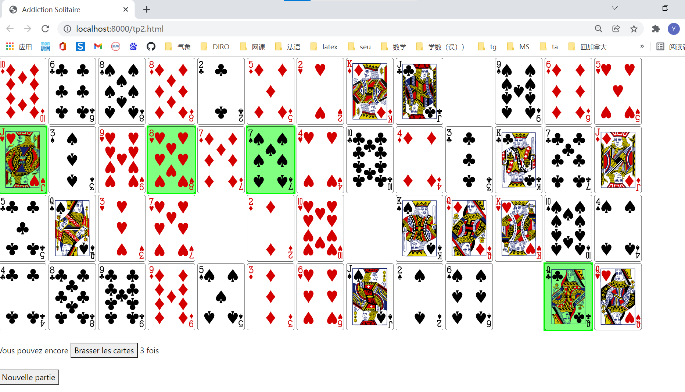

# IFT1015_Projet_Addiction_Solitaire

**Steps for executing the web applicatoin:**
1. Execute program `serveur-web.py` with `linux > python3 serveur-web.py`
2. Open your browser and visit [http://localhost:8000/tp2.html](http://localhost:8000/tp2.html)
3. Let us play ^^ !

**Consult [tp2.pdf](tp2.pdf) for more details about the game!**

 
 
 

<b>

 Screenshout of the game
</b>

 
 

